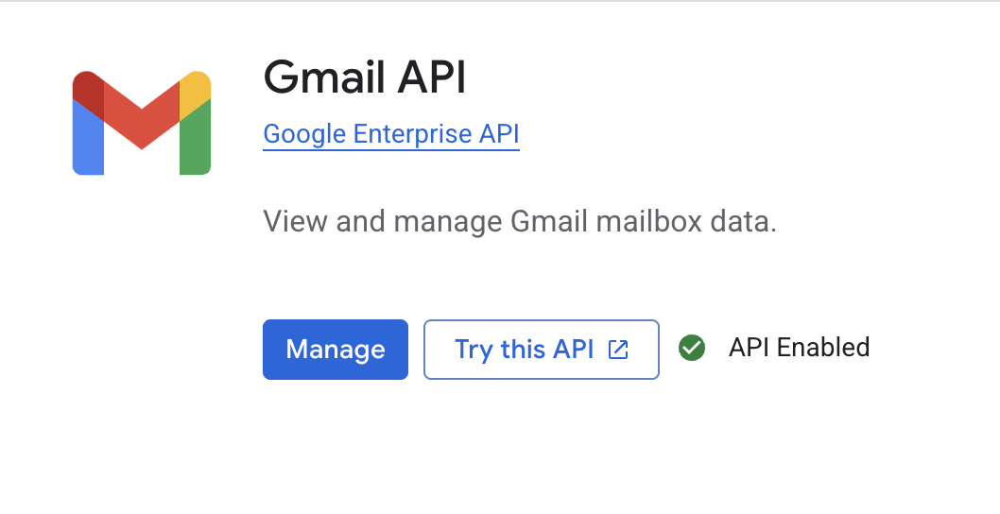
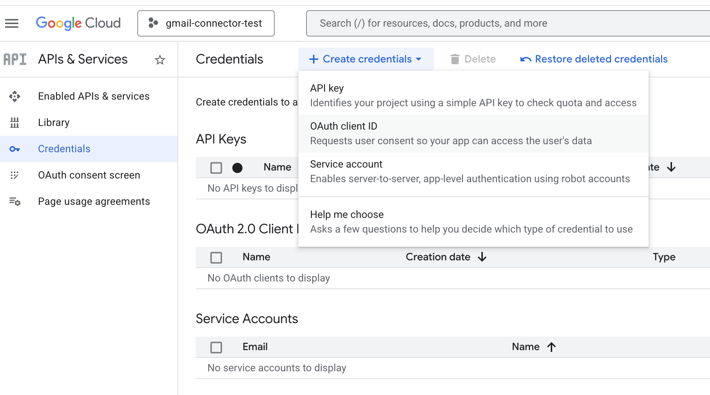
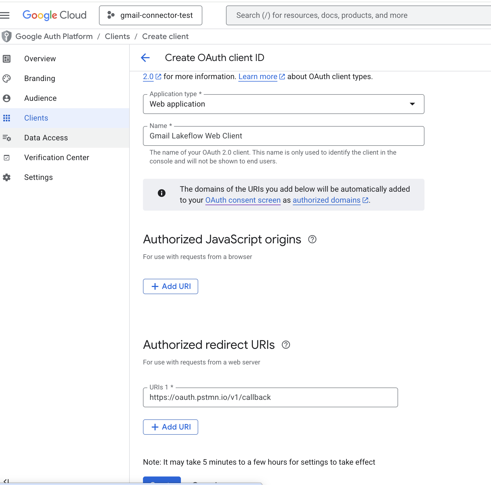
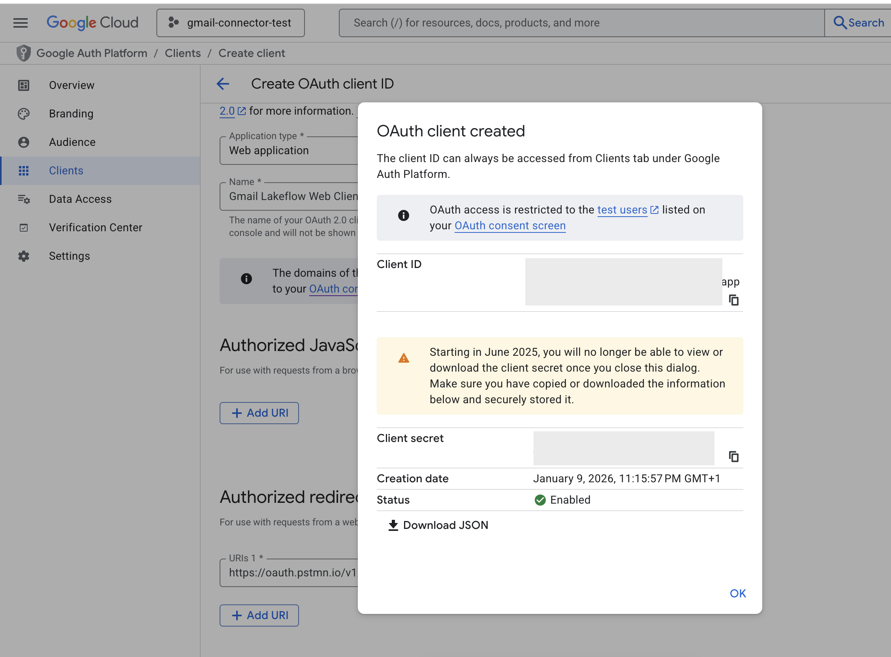
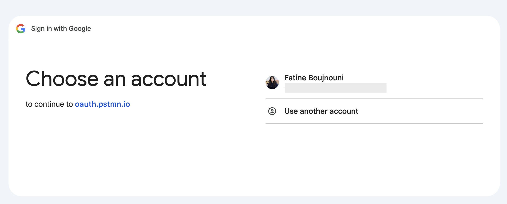
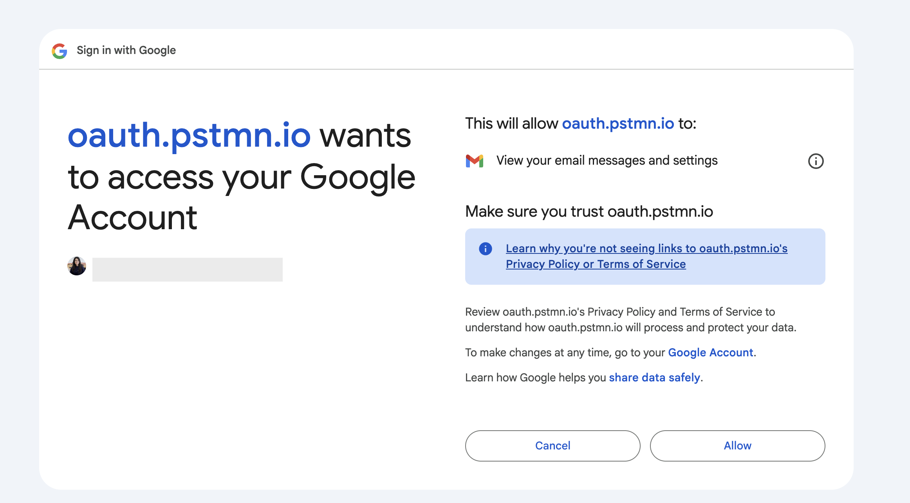
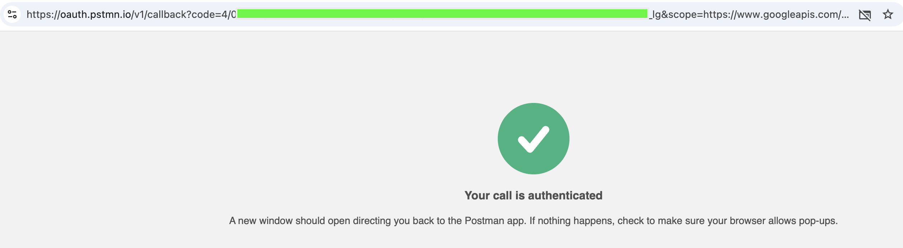
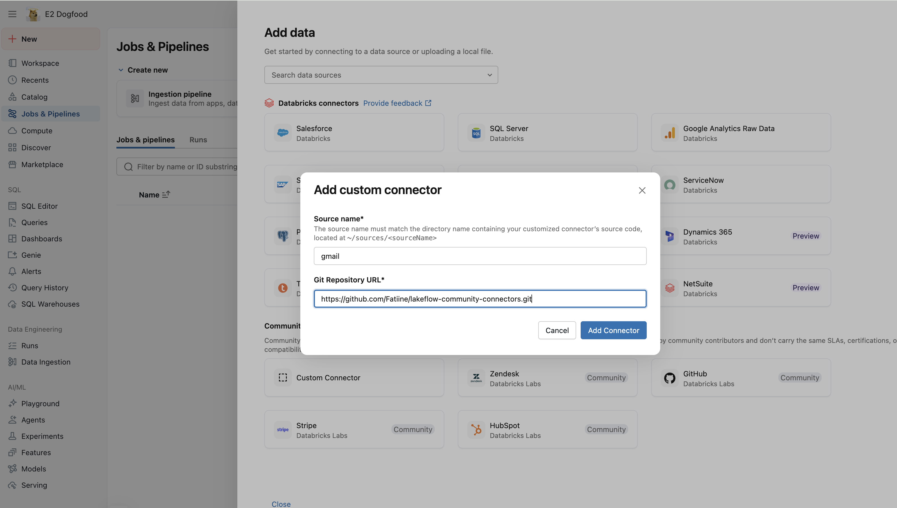
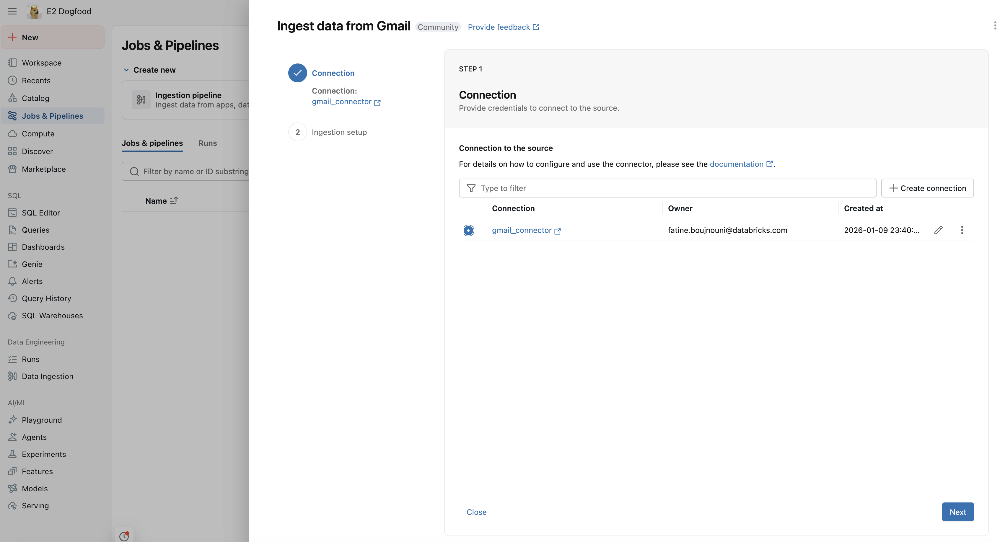
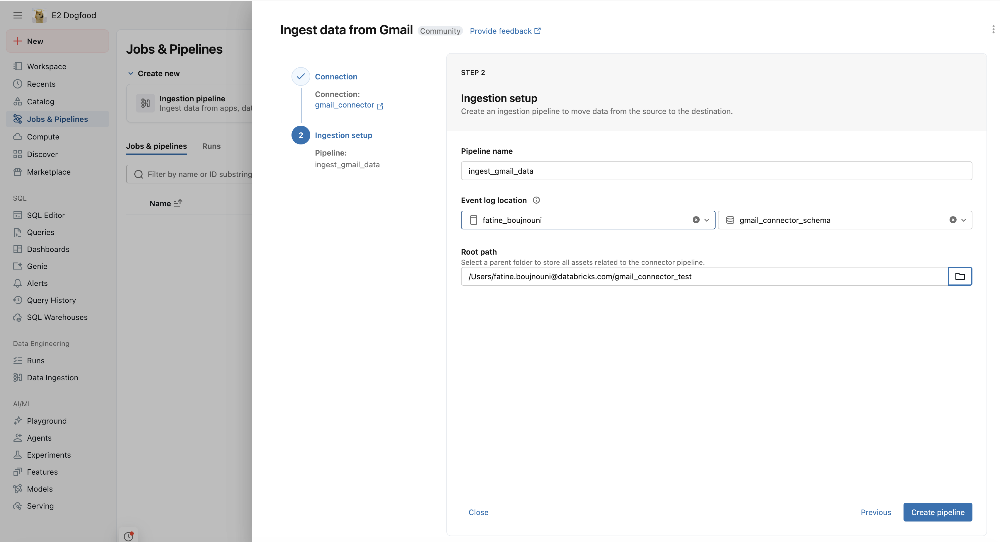

# Lakeflow Gmail Community Connector

This documentation describes how to configure and use the **Gmail** Lakeflow community connector to ingest email data from the Gmail API into Databricks.

## Prerequisites

- **Google Account**: A Google account with Gmail access (personal Gmail or Google Workspace).
- **Google Cloud Project**: A project in Google Cloud Console with the Gmail API enabled.
- **OAuth 2.0 Credentials**:
  - `client_id`: OAuth 2.0 client ID
  - `client_secret`: OAuth 2.0 client secret
  - `refresh_token`: Long-lived refresh token obtained via OAuth consent flow
- **Required OAuth Scope**: `https://www.googleapis.com/auth/gmail.readonly`
- **Network access**: The environment must be able to reach `https://gmail.googleapis.com`.
- **Lakeflow / Databricks environment**: A workspace where you can register a Lakeflow community connector and run ingestion pipelines.

## Setup

### Required Connection Parameters

Provide the following **connection-level** options when configuring the connector:

| Name | Type | Required | Description | Example |
|------|------|----------|-------------|---------|
| `client_id` | string | yes | OAuth 2.0 client ID from Google Cloud Console | `123456789-abc.apps.googleusercontent.com` |
| `client_secret` | string | yes | OAuth 2.0 client secret | `GOCSPX-xxxx...` |
| `refresh_token` | string | yes | Long-lived refresh token from OAuth flow | `1//0xxxx...` |
| `user_id` | string | no | User email or `me` (default: `me`) | `user@gmail.com` |
| `externalOptionsAllowList` | string | no | Comma-separated list of table-specific options (optional for this connector) | `tableName,tableNameList,tableConfigs,isDeleteFlow,q,labelIds,maxResults,includeSpamTrash,format` |

The full list of supported table-specific options for `externalOptionsAllowList` is:
`q,labelIds,maxResults,includeSpamTrash,format`

> **Note**: Table-specific options are optional for Gmail. If you want to use query filters or customize message formats, include these option names in `externalOptionsAllowList`.

### Obtaining OAuth Credentials

Follow these steps to obtain the OAuth credentials required for the Gmail connector.

---

#### Step 1: Create a Google Cloud Project and Enable Gmail API

1. Go to [Google Cloud Console](https://console.cloud.google.com/)
2. Click **Select a project** → **New Project**
3. Enter a project name (e.g., "Gmail Lakeflow Connector") and click **Create**
4. Once created, select your new project
5. Navigate to **APIs & Services → Library**
6. Search for "Gmail API" and click on it
7. Click **Enable**



---

#### Step 2: Configure OAuth Consent Screen

Before creating credentials, you must configure the OAuth consent screen:
1. Go to **APIs & Services → OAuth consent screen**
2. Click **Get started** or **Create**
3. Fill in the **App Information**:
   - **App name**: `Gmail Lakeflow Connector` (or your preferred name)
   - **User support email**: Your email address
4. Fill in **Developer contact information**:
   - **Email addresses**: Your email address
5. Select **External** (for personal Gmail accounts) or **Internal** (for Google Workspace organizations)
6. Click **Save and Continue**
7. On the **Audience** page:
   - If External, click **Add Users** under **Test users**
   - Enter your Gmail address and click **Add**
8. Click **Save and Continue**
9. On the **Data Access** page, click **Add or Remove Scopes**
10. Search for `gmail.readonly` and check the box for:
   - `https://www.googleapis.com/auth/gmail.readonly`
11. Click **Update** → **Save and Continue**

---

#### Step 3: Create OAuth 2.0 Credentials

1. Go to **APIs & Services → Credentials**
2. Click **Create Credentials → OAuth client ID**



3. Select **Web application** as the Application type
4. Enter a name (e.g., "Gmail Lakeflow Web Client")
5. Under **Authorized redirect URIs**, click **Add URI** and enter:
   ```
   https://oauth.pstmn.io/v1/callback
   ```
   > This redirect URI is used to capture the authorization code in the next step.



6. Click **Create**
7. A dialog will appear with your credentials. **Copy and save** both:
   - **Client ID** (e.g., `123456789-abc.apps.googleusercontent.com`)
   - **Client Secret** (e.g., `GOCSPX-xxxx...`)



---

#### Step 4: Obtain a Refresh Token

Now you'll authorize the app and obtain a refresh token. This is a one-time process.

**4.1. Build the Authorization URL**

Replace `YOUR_CLIENT_ID` in the URL below with your actual Client ID:

```
https://accounts.google.com/o/oauth2/v2/auth?client_id=YOUR_CLIENT_ID&redirect_uri=https://oauth.pstmn.io/v1/callback&response_type=code&scope=https://www.googleapis.com/auth/gmail.readonly&access_type=offline&prompt=consent
```


**4.2. Authorize the Application**

1. Open the URL in your web browser
2. Sign in with the Google account you want to connect
3. Click **Continue** on the "Google hasn't verified this app" warning (since this is your own app)
4. Grant permission to view your email messages and settings
5. You'll be redirected to a page showing a callback URL




**4.3. Copy the Authorization Code**

After authorization, you'll be redirected to a URL like:
```
https://oauth.pstmn.io/v1/callback?code=4/0AfJohXl...&scope=...
```

Copy the `code` parameter value (everything after `code=` and before `&scope`).



**4.4. Exchange the Code for a Refresh Token**

Run this `curl` command in your terminal, replacing the placeholders:

```bash
curl -X POST https://oauth2.googleapis.com/token \
  -d "code=YOUR_AUTHORIZATION_CODE" \
  -d "client_id=YOUR_CLIENT_ID" \
  -d "client_secret=YOUR_CLIENT_SECRET" \
  -d "redirect_uri=https://oauth.pstmn.io/v1/callback" \
  -d "grant_type=authorization_code"
```

**4.5. Save the Refresh Token**

The response will look like:
```json
{
  "access_token": "ya29.a0AfH6SM...",
  "expires_in": 3599,
  "refresh_token": "1//0eXXXXXXXXXXX-XXXXXXXXXXXXXXXXX",
  "scope": "https://www.googleapis.com/auth/gmail.readonly",
  "token_type": "Bearer"
}
```

**Copy the `refresh_token` value and save it securely.** This token does not expire and will be used by the connector to access Gmail.

> ⚠️ **Important**: The refresh token is only returned on the first authorization. If you need a new one, you must revoke access at [Google Account Permissions](https://myaccount.google.com/permissions) and repeat this process.

---

#### Summary: Your Three Credentials

You now have the three values needed for the connector:

| Credential | Example | Where to find it |
|------------|---------|------------------|
| `client_id` | `123456789-abc.apps.googleusercontent.com` | Step 3 - OAuth client creation |
| `client_secret` | `GOCSPX-xxxx...` | Step 3 - OAuth client creation |
| `refresh_token` | `1//0eXXXX...` | Step 4 - Token exchange response |

### Create a Unity Catalog Connection

You need to create a Unity Catalog connection to securely store your Gmail OAuth credentials. Choose one of the methods below.

---

#### Option A: Using SQL Editor (Recommended)

Run the following SQL command in Databricks SQL Editor or a notebook:

```sql
CREATE CONNECTION gmail_connector
TYPE GENERIC_LAKEFLOW_CONNECT
OPTIONS (
  sourceName = 'gmail',
  client_id = '<YOUR_CLIENT_ID>',
  client_secret = '<YOUR_CLIENT_SECRET>',
  refresh_token = '<YOUR_REFRESH_TOKEN>',
  externalOptionsAllowList = 'tableName,tableNameList,tableConfigs,isDeleteFlow,q,labelIds,maxResults,includeSpamTrash,format'
);
```

---

#### Option B: Using Databricks UI

1. In Databricks, go to **Catalog** in the left sidebar
2. Click on the gear icon, then **Connections**
3. Click **Create connection**
4. Fill in the connection details:
   - **Connection name**: `gmail_connector`
   - **Connection type**: Select `Lakeflow community connector`
5. In the **Connection options** section, add the following key-value pairs:

| Key | Value |
|-----|-------|
| `sourceName` | `gmail` |
| `client_id` | Your OAuth Client ID |
| `client_secret` | Your OAuth Client Secret |
| `refresh_token` | Your Refresh Token |
| `externalOptionsAllowList` | `tableName,tableNameList,tableConfigs,isDeleteFlow,q,labelIds,maxResults,includeSpamTrash,format` |

6. Click **Create**

## Supported Objects

The Gmail connector provides **100% API coverage** with the following tables:

### Core Email Data
- `messages` - Email messages with full content
- `threads` - Email conversation threads
- `labels` - Gmail labels (system and user)
- `drafts` - Draft messages

### Account Information
- `profile` - User profile and mailbox statistics

### Settings & Configuration
- `settings` - Combined account settings (IMAP, POP, vacation, language, auto-forwarding)
- `filters` - Email filter rules
- `forwarding_addresses` - Configured forwarding addresses
- `send_as` - Send-as email aliases
- `delegates` - Delegated access users

### Object Summary, Primary Keys, and Ingestion Mode

| Table | Description | Ingestion Type | Primary Key | Cursor Field |
|-------|-------------|----------------|-------------|--------------|
| `messages` | Individual email messages with headers and body | `cdc` | `id` | `historyId` |
| `threads` | Email conversation threads containing messages | `cdc` | `id` | `historyId` |
| `labels` | Gmail labels including system and user labels | `snapshot` | `id` | n/a |
| `drafts` | Draft messages in the mailbox | `snapshot` | `id` | n/a |
| `profile` | User email, message/thread counts, historyId | `snapshot` | `emailAddress` | n/a |
| `settings` | IMAP, POP, vacation, language, forwarding settings | `snapshot` | `emailAddress` | n/a |
| `filters` | Email filter rules with criteria and actions | `snapshot` | `id` | n/a |
| `forwarding_addresses` | Email forwarding destinations | `snapshot` | `forwardingEmail` | n/a |
| `send_as` | Send-as aliases and signatures | `snapshot` | `sendAsEmail` | n/a |
| `delegates` | Users with delegated mailbox access | `snapshot` | `delegateEmail` | n/a |

### Incremental Sync Strategy

For `messages` and `threads` tables, the connector uses Gmail's **History API** for efficient incremental synchronization:

- **Initial sync**: Lists all items and captures the latest `historyId`
- **Subsequent syncs**: Uses `historyId` to fetch only added/modified items since the last sync
- **Automatic fallback**: If `historyId` expires (~30 days), automatically falls back to a full sync

### Delete Synchronization

The connector supports delete tracking for `messages` and `threads` via the `read_table_deletes` method:

- Uses Gmail History API with `historyTypes=messageDeleted`
- Returns minimal records (primary key + cursor) for deleted items
- Enables downstream systems to soft-delete or remove records

### Required and Optional Table Options

Table-specific options are passed via the pipeline spec under `table` in `objects`:

| Option | Type | Tables | Description |
|--------|------|--------|-------------|
| `q` | string | messages, threads | Gmail search query (same syntax as Gmail web UI) |
| `labelIds` | string | messages, threads | Filter by label ID (e.g., `INBOX`, `SENT`) |
| `maxResults` | integer | all | Maximum items per page (default: 100, max: 500) |
| `includeSpamTrash` | boolean | messages, threads | Include spam and trash (default: false) |
| `format` | string | messages, threads, drafts | Message format: `full` (default), `metadata`, `minimal` |

### Schema Highlights

**messages**:
- `id`, `threadId` - Unique identifiers
- `labelIds` - Array of label IDs applied to the message
- `snippet` - Short preview of message content
- `historyId` - Used for incremental sync cursor
- `internalDate` - Epoch milliseconds of message creation
- `payload` - Full parsed message structure including headers and body parts

**threads**:
- `id` - Thread identifier
- `snippet` - Preview of latest message
- `messages` - Array of messages in the thread

**labels**:
- `id`, `name` - Label identification
- `type` - `system` or `user`
- `messagesTotal`, `messagesUnread` - Message counts
- `color` - Label color settings

**drafts**:
- `id` - Draft identifier
- `message` - Full message content of the draft

**profile**:
- `emailAddress` - User's email address
- `messagesTotal`, `threadsTotal` - Mailbox counts
- `historyId` - Current history ID for sync

**settings**:
- `emailAddress` - User identifier
- `autoForwarding` - Auto-forwarding configuration
- `imap` - IMAP access settings
- `pop` - POP access settings
- `language` - Display language
- `vacation` - Vacation auto-reply settings

**filters**:
- `id` - Filter identifier
- `criteria` - Match criteria (from, to, subject, query, etc.)
- `action` - Actions (addLabelIds, removeLabelIds, forward)

**forwarding_addresses**:
- `forwardingEmail` - Forwarding destination email
- `verificationStatus` - Verification state

**send_as**:
- `sendAsEmail` - Send-as email address
- `displayName`, `signature` - Display settings
- `isPrimary`, `isDefault` - Status flags
- `verificationStatus` - Verification state

**delegates**:
- `delegateEmail` - Delegate's email address
- `verificationStatus` - Delegation status

## Data Type Mapping

| Gmail API Type | Spark SQL Type | Notes |
|----------------|----------------|-------|
| string | `StringType` | Standard text fields |
| string (int64) | `StringType` | `historyId`, `internalDate` stored as strings |
| integer | `LongType` | `sizeEstimate`, message counts |
| boolean | `BooleanType` | Flag fields |
| array[string] | `ArrayType(StringType)` | `labelIds` |
| array[object] | `ArrayType(StructType)` | `headers`, `parts`, `messages` |
| object | `StructType` | `payload`, `body`, `color` |

The connector:
- Preserves nested structures (headers, parts) instead of flattening
- Uses `StructType` for nested objects to enforce schema
- Treats missing nested objects as `null` (not `{}`)

## How to Run

### Step 1: Create an ingestion pipeline

1. On  the left sidebar, go to Jobs & Pipelines, the click on create Ingestion pipeline. 
2. Select 'Custom Connector' on the Community connectors section. 
3. Fill the source name of the connector `gmail` and the Git Repository URL where the connector is merged. 

4. On connection, select the gmail connection configured on the previous steps. 

5. Select an event log location : catalog + schema, and a Root path where the assets related to the connector would be stored. 


### Step 2: Configure Your `ingest.py` File

Copy the `pipeline-spec/example_ingest.py` file and modify it for Gmail. Here's a complete example:

#### Basic Configuration (Start Here)

```python
from pipeline.ingestion_pipeline import ingest
from libs.source_loader import get_register_function

# Set the connector source name
source_name = "gmail"

# Configure your pipeline
pipeline_spec = {
    "connection_name": "gmail_connection",  # Your Unity Catalog connection name
    "objects": [
        # Start with labels to validate credentials
        {
            "table": {
                "source_table": "labels",
            }
        },
    ],
}

# Register the Gmail source and run ingestion
register_lakeflow_source = get_register_function(source_name)
register_lakeflow_source(spark)
ingest(spark, pipeline_spec)
```

#### Full Example with Multiple Tables

```python
from pipeline.ingestion_pipeline import ingest
from libs.source_loader import get_register_function

source_name = "gmail"

pipeline_spec = {
    "connection_name": "gmail_connection",
    "objects": [
        # Messages - with query filter for recent emails
        {
            "table": {
                "source_table": "messages",
                "table_configuration": {
                    "q": "newer_than:7d",           # Only last 7 days
                    "maxResults": "100",            # Batch size
                    "labelIds": "INBOX",            # Only inbox
                }
            }
        },
        # Threads
        {
            "table": {
                "source_table": "threads",
                "table_configuration": {
                    "maxResults": "50",
                }
            }
        },
        # Labels (no options needed)
        {
            "table": {
                "source_table": "labels",
            }
        },
        # Profile
        {
            "table": {
                "source_table": "profile",
            }
        },
        # Settings
        {
            "table": {
                "source_table": "settings",
            }
        },
        # Drafts
        {
            "table": {
                "source_table": "drafts",
            }
        },
        # Filters
        {
            "table": {
                "source_table": "filters",
            }
        },
        # Forwarding addresses
        {
            "table": {
                "source_table": "forwarding_addresses",
            }
        },
        # Send-as aliases
        {
            "table": {
                "source_table": "send_as",
            }
        },
        # Delegates
        {
            "table": {
                "source_table": "delegates",
            }
        },
    ],
}

register_lakeflow_source = get_register_function(source_name)
register_lakeflow_source(spark)
ingest(spark, pipeline_spec)
```

#### Table Configuration Options Reference

| Option | Type | Tables | Description |
|--------|------|--------|-------------|
| `q` | string | messages, threads | Gmail search query (e.g., `newer_than:7d`, `from:user@example.com`) |
| `labelIds` | string | messages, threads | Filter by label ID (`INBOX`, `SENT`, `DRAFT`, `SPAM`, `TRASH`) |
| `maxResults` | string | all | Max items per page (`"100"`, max `"500"`) |
| `includeSpamTrash` | string | messages, threads | Include spam/trash (`"true"` or `"false"`) |
| `format` | string | messages, threads, drafts | Message format (`"full"`, `"metadata"`, `"minimal"`) |

#### Available Tables Quick Reference

| Table | Description | Recommended First Test |
|-------|-------------|------------------------|
| `labels` | Gmail labels | ✅ Start here (simple, validates auth) |
| `profile` | User profile info | ✅ Single record |
| `messages` | Email messages | Use with `q` filter |
| `threads` | Email threads | Use with `maxResults` |
| `drafts` | Draft messages | |
| `settings` | Account settings | |
| `filters` | Email filter rules | |
| `forwarding_addresses` | Forwarding config | |
| `send_as` | Send-as aliases | |
| `delegates` | Delegated access | |

> **Tip**: Start with the `labels` table to validate your credentials before ingesting larger tables like `messages` or `threads`.

### Step 3: Run and Schedule the Pipeline

Run the pipeline using your standard Lakeflow / Databricks orchestration:

- **First run**: Performs a full sync of all matching items
- **Subsequent runs**: Uses `historyId` cursor for incremental updates (messages/threads only)

#### Best Practices

- **Start small**: Begin with `labels` table to validate credentials, then add `messages` with a query filter like `q=newer_than:7d`
- **Use incremental sync**: For `messages` and `threads`, rely on the CDC pattern with `historyId` cursor to minimize API calls
- **Filter by label**: Use `labelIds=INBOX` to focus on inbox messages rather than all mail
- **Choose appropriate format**: Use `format=metadata` if you only need headers, `format=full` for complete message bodies
- **Respect rate limits**: Gmail allows 25,000 queries per 100 seconds per user; the connector implements exponential backoff for 429 errors

#### Troubleshooting

**Pipeline Configuration Issues:**

- **"Connection not found"**:
  - Verify `connection_name` in your `pipeline_spec` matches your Unity Catalog connection exactly
  - Check that the connection was created successfully in Unity Catalog

- **"Table not supported"**:
  - Check spelling of `source_table` - must be one of the 10 supported tables
  - Supported tables: `messages`, `threads`, `labels`, `drafts`, `profile`, `settings`, `filters`, `forwarding_addresses`, `send_as`, `delegates`

- **"Source not found" or module import errors**:
  - Ensure `source_name = "gmail"` is set correctly
  - Verify the Gmail connector files are in `src/databricks/labs/community_connector/sources/gmail/` directory

**API and Authentication Issues:**

- **Authentication failures (`401 Unauthorized`)**:
  - Verify `client_id`, `client_secret`, and `refresh_token` are correct
  - Ensure the refresh token hasn't been revoked
  - Refresh tokens expire if unused for 6 months - regenerate by repeating Step 4 of the OAuth setup
  - Check that the OAuth consent screen includes the `gmail.readonly` scope

- **`403 Forbidden`**:
  - The Gmail API may not be enabled in your Google Cloud project
  - For Google Workspace accounts, the admin may need to authorize the app

- **`404 Not Found` on history API**:
  - The `historyId` has expired (~30 days old)
  - The connector will automatically fall back to a full sync

- **Rate limiting (`429`)**:
  - The connector automatically retries with exponential backoff
  - If persistent, reduce `maxResults` or widen schedule intervals

- **Empty results**:
  - Check your `q` query syntax matches Gmail search syntax
  - Verify the authenticated user has emails matching your filters

## Efficiency Features

This connector includes several optimizations for high-performance data ingestion:

- **Parallel fetching**: Uses ThreadPoolExecutor with 5 workers to fetch message/thread details concurrently
- **Connection pooling**: Reuses HTTP sessions for multiple requests
- **Token caching**: Caches OAuth access tokens until expiration to avoid redundant token exchanges
- **Graceful error handling**: Handles 403 errors gracefully for restricted endpoints

## References

- Connector implementation: `src/databricks/labs/community_connector/sources/gmail/gmail.py`
- Connector API documentation: `src/databricks/labs/community_connector/sources/gmail/gmail_api_doc.md`
- Official Gmail API documentation:
  - https://developers.google.com/workspace/gmail/api/reference/rest
  - https://developers.google.com/workspace/gmail/api/guides
  - https://developers.google.com/workspace/gmail/api/reference/rest/v1/users.messages
  - https://developers.google.com/workspace/gmail/api/reference/rest/v1/users.threads
  - https://developers.google.com/workspace/gmail/api/reference/rest/v1/users.labels
  - https://developers.google.com/workspace/gmail/api/reference/rest/v1/users.drafts
  - https://developers.google.com/workspace/gmail/api/reference/rest/v1/users.history

